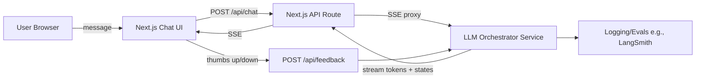

# Hunt-Bot Architecture

This document describes the architecture of hunt-bot, based on what's already in the repo (Next.js UI + API routes proxying to a separate orchestrator service).

## 1. System Overview

### hunt-bot-v1 (this repo)

- **Next.js 15** (App Router) provides the chat UI + API routes
- `/api/chat` proxies to the remote orchestrator endpoint `ORCHESTRATOR_URL/orchestrator/stream-answer`, then forwards the stream (SSE) to the browser
- `/api/feedback` proxies user feedback (thumbs up/down + optional metadata) to the orchestrator `/feedback`

### Orchestrator (separate service)

Owns the "LLM brain": routing, tool-calling, RAG/SQL phases, final response assembly, and feedback ingestion.

## 2. High-Level Architecture Diagram (LLM-centric)



This matches the repo's described workflow: browser → `/api/chat` → orchestrator streaming → browser, plus feedback → `/api/feedback` → orchestrator.

## 3. Runtime Flow (Request → Streaming Answer)

1. User sends a message from the chat page → `POST /api/chat` with `{ message }`
2. Next.js API route sends `{ session_id, request_id, question }` to:
   ```
   POST {ORCHESTRATOR_URL}/orchestrator/stream-answer
   ```
3. Orchestrator streams SSE back, and the API route forwards events to the client (status, result, error)
4. Client consumes SSE and updates the chat UI in real time
5. **Feedback loop**: thumbs up/down → `POST /api/feedback` → orchestrator `/feedback`

## 4. Orchestrator "LLM Architecture" (Core Components)

When writing the architecture doc, describe the orchestrator as a staged agent pipeline:

### A. Input Layer

- Normalize `{session_id, request_id, question}`
- Optional: rewrite/clarify step (short, deterministic prompt)

### B. Router / Planner

- Decide which tools to use (SQL vs RAG vs both vs none)
- Produce a plan: `[{phase: "sql", ...}, {phase: "rag", ...}]`

### C. Tool Execution

- **SQL phase**: generate SQL → execute → return structured rows + provenance
- **RAG phase**: retrieve → rerank → cite chunks
- Enforce timeouts + retries per phase (important for SSE UX)

### D. Answer Synthesis

- Compose final answer grounded in evidence
- Attach `agent_graph_run_id` (so feedback can map back to traces)

### E. Streaming Protocol

- Stream "state events" (phase start/end) + "token events" (answer text)
- Stream errors with enough info for UI to show graceful fallbacks

### F. Feedback + Eval

- Store thumbs up/down with: `rating`, `feedback_type`, `comment`, and `run id`
- Feed into offline evaluation (or auto-judge) to improve prompts/tool routing

## 5. Production-Ready Enhancements

If you want the doc to read like a real production design, include these:

- **Grounding contract**: final answers must cite SQL rows / RAG chunks; otherwise return "insufficient evidence"
- **Guardrails**: detect hallucination / missing evidence; fallback to "evidence-only summary"
- **Observability**: trace per `request_id`, log tool latency, token usage, and failure rates
- **Caching**: short-lived cache keyed by `(question, session_id, tool_config_hash)` for repeated queries
- **Rate limiting**: per-IP / per-session to protect orchestrator
- **SSE resilience**: client reconnect strategy + idempotent request handling using `request_id`

## 6. Suggested Documentation Structure

Add a doc like: `docs/llm-architecture.md`

Suggested sections:

- "System Context"
- "Sequence Diagram"
- "Orchestrator Internals"
- "Tool Contracts"
- "SSE Event Schema"
- "Failure Modes & Fallbacks"
- "Feedback + Evals"

If you want, paste your orchestrator's stream-answer SSE event schema (a real example stream), and I'll write the full ready-to-commit `docs/llm-architecture.md` in clean English with diagrams and concrete payload examples.
